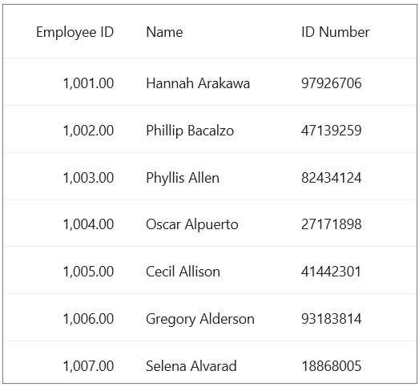

# How to bind a column collection from view model in MAUI DataGrid? 

The [.NET MAUI DataGrid](https://www.syncfusion.com/maui-controls/maui-datagrid) provides the support to bind the [SfDataGrid.Columns](https://help.syncfusion.com/cr/maui/Syncfusion.Maui.DataGrid.SfDataGrid.html#Syncfusion_Maui_DataGrid_SfDataGrid_Columns) to a property in the ViewModel by having the binding property to be of type `ColumnCollection` or `List<DataGridColumn>` in the ViewModel.

Refer the below code example in which the DataGridColumns property is bind to the `SfDataGrid.Columns` property.

## XAML
In the XAML page, bind the DataGridColumns property to the SfDataGrid.Columns.

```XML
<syncfusion:SfDataGrid  x:Name="datagrid"
                        ItemsSource="{Binding Employees}"
                        Columns="{Binding DataGridColumns}"
                        AutoGenerateColumnsMode="None"
                        DefaultColumnWidth="155">
</syncfusion:SfDataGrid>
```

## ViewModel.cs
Create a property in the ViewModel class to bind with a type that can be either `List<DataGridColumn>` or `Syncfusion.Maui.DataGrid.ColumnCollection`. Assign the appropriate values to this property within the constructor.

```C#
private ColumnCollection dataGridColumns;

public ColumnCollection DataGridColumns
{
    get { return dataGridColumns; }
    set
    {
        dataGridColumns = value;
    }
}
public EmployeeViewModel()
{
    this.DataGridColumns = new ColumnCollection
    {
        new DataGridNumericColumn(){ MappingName = "EmployeeID" , HeaderText="Employee ID"},
        new DataGridTextColumn(){ MappingName = "Name" , HeaderText = "Name"},
        new DataGridTextColumn(){ MappingName = "IDNumber", HeaderText ="ID Number"},
    };

}
```
The following screenshot shows column collection binded from a property in view model.



[View sample in GitHub]()

Take a moment to pursue this [documentation](https://help.syncfusion.com/maui/datagrid/overview), where you can find more about Syncfusion .NET MAUI DataGrid (SfDataGrid) with code examples.
Please refer to this [link](https://www.syncfusion.com/maui-controls/maui-datagrid) to learn about the essential features of Syncfusion .NET MAUI DataGrid(SfDataGrid).

### Conclusion
I hope you enjoyed learning about how to bind a column collection from view model in MAUI SfDataGrid?

You can refer to our [.NET MAUI DataGrid�s feature tour](https://www.syncfusion.com/maui-controls/maui-datagrid) page to know about its other groundbreaking feature representations. You can also explore our .NET MAUI DataGrid Documentation to understand how to present and manipulate data.
For current customers, you can check out our .NET MAUI components from the [License and Downloads](https://www.syncfusion.com/account/downloads) page. If you are new to Syncfusion, you can try our 30-day free trial to check out our .NET MAUI DataGrid and other .NET MAUI components.
If you have any queries or require clarifications, please let us know in comments below. You can also contact us through our [support forums](https://www.syncfusion.com/forums), [Direct-Trac](https://support.syncfusion.com/account/login?ReturnUrl=%2Faccount%2Fconnect%2Fauthorize%2Fcallback%3Fclient_id%3Dc54e52f3eb3cde0c3f20474f1bc179ed%26redirect_uri%3Dhttps%253A%252F%252Fsupport.syncfusion.com%252Fagent%252Flogincallback%26response_type%3Dcode%26scope%3Dopenid%2520profile%2520agent.api%2520integration.api%2520offline_access%2520kb.api%26state%3D8db41f98953a4d9ba40407b150ad4cf2%26code_challenge%3DvwHoT64z2h21eP_A9g7JWtr3vp3iPrvSjfh5hN5C7IE%26code_challenge_method%3DS256%26response_mode%3Dquery) or [feedback portal](https://www.syncfusion.com/feedback/maui?control=sfdatagrid). We are always happy to assist you!